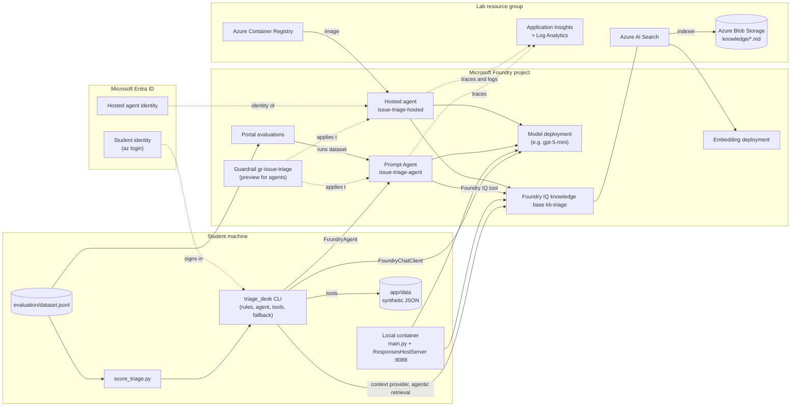

# Architecture

The lab builds one application, the Contoso Telecom **Issue Triage Assistant**, and extends it module by module. The same code runs as a local CLI, a local container, and a Microsoft Foundry hosted agent. A portal Prompt Agent with the same instructions is used for the portal-based modules.

## Component diagram

## Required and optional components

| Component | Status | Introduced | Purpose |
|---|---|---|---|
| Local Python application (`app/triage_desk`) | Required | Module 2 | Business workflow, rules baseline, CLI |
| Microsoft Agent Framework (`agent-framework-*`) | Required | Module 3 | Agent, tools, sessions, middleware, context providers, hosting adapter |
| Microsoft Foundry resource and project (new experience) | Required | Module 1 | Workspace for models, agents, knowledge, guardrails, evaluations |
| Chat model deployment | Required | Module 1 | Reasoning for the Prompt Agent and the code-defined agent |
| Prompt Agent `issue-triage-agent` | Required | Module 1 | Portal-defined agent; target for Modules 4, 8, 9 |
| Application functions as tools (`get_issue`, `get_customer_context`, `route_issue`) | Required | Module 3.3 | Read-only access to synthetic data and the routing policy |
| Azure Blob Storage | Optional (Module 4 option A) | Module 4 | Holds the knowledge documents when the Blob knowledge source is used; option B (File knowledge source, preview) uploads them directly to Azure AI Search |
| Azure AI Search + Foundry IQ knowledge base | Required | Module 4 | Agentic retrieval over the knowledge documents (portal access is preview) |
| Embedding model deployment | Required | Module 4 | Vectorization for the knowledge source |
| Local container | Required | Module 6 | Same agent packaged for hosting |
| Azure Container Registry | Required | Module 7 | Stores the agent image (created or selected by `azd`) |
| Hosted agent `issue-triage-hosted` | Required | Module 7 | Same agent running in Foundry Agent Service |
| Guardrail `gr-issue-triage` | Required | Module 8 | Content safety and prompt-attack controls (agent guardrails preview) |
| Application Insights + Log Analytics | Required | Module 8 | Traces, monitoring dashboard, hosted agent telemetry (tracing preview) |
| Evaluation dataset + portal evaluation + judge model | Required | Module 9 | Quality and safety evaluation |
| Microsoft Defender integration | **Optional** | Module 8 (discussion) | AI threat protection; separate enablement and licensing |
| Microsoft Purview integration | **Optional** | Module 8 (discussion) | Data security and compliance for AI interactions; separate enablement and licensing |

## Request flow (code-defined agent, final state)

1. The CLI loads the issue and validates the text (Exercise 3.5a).
2. `build_triage_agent()` creates an `Agent` with a `FoundryChatClient`, the triage instructions, three tools, the tool-logging middleware, and (Module 5) the Foundry IQ context provider.
3. Before the model call, the context provider queries the knowledge base (agentic retrieval, extractive data) and adds the retrieved content to the context. The references it returns are recorded for display.
4. The model may call `get_customer_context` and `route_issue`. The app runs these functions locally and returns the results.
5. The model returns a `TriageDecision` (structured output).
6. The app validates it and **enforces the routing policy** from `routing_rules.json`.
7. If anything fails or times out, the app falls back to the rules engine and says so.

In hosted mode, `main.py` wraps the same agent in `ResponsesHostServer`. The Foundry gateway routes requests to port 8088 of the container; the platform manages sessions, identity, scaling, and telemetry.

## Identity and authentication

| Caller | Identity | Credential in code | Access needed |
|---|---|---|---|
| CLI on a student machine | Student's Microsoft Entra user (`az login`) | `DefaultAzureCredential` | Foundry User on the project; Search Index Data Reader on the search service (Module 5) |
| Local container (Module 6 only) | Student's user, via short-lived tokens | `LocalDevTokenCredential` (only when `LAB_DEV_TOKEN_*` is set) | Same as the CLI |
| Hosted agent | Platform-created agent identity | `DefaultAzureCredential` (managed by the platform) | Model access by default; Search Index Data Reader assigned in Module 7.7 |
| Portal Prompt Agent to the knowledge base | Project connection (key in the official lab flow; managed identity recommended) | n/a | See Module 4.4 |
| Search service to Blob Storage | Knowledge source authentication (key or managed identity) | n/a | See Module 4.3 |

No keys, tokens, or connection strings are stored in the repository or the image.

## Where data is stored or processed
- **Foundry Agent Service**: agent definitions and versions, and conversations or sessions created through the agents.
- **Azure AI Search**: index of the knowledge documents.
- **Azure Blob Storage**: the knowledge documents.
- **Application Insights / Log Analytics**: traces, which can include prompts, responses, and tool arguments.
- **Foundry project data**: the uploaded evaluation dataset and evaluation results.

All lab data is synthetic. Review the data privacy references in [cost-and-cleanup.md](cost-and-cleanup.md#data-and-privacy) before using real data.
