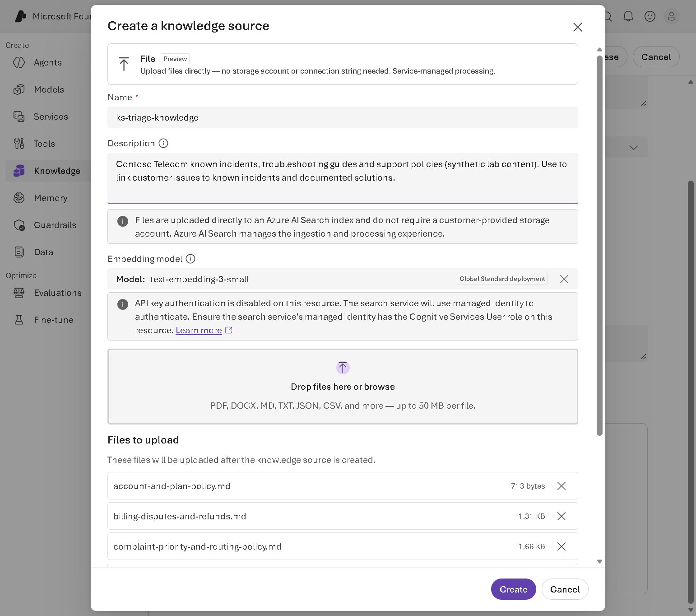
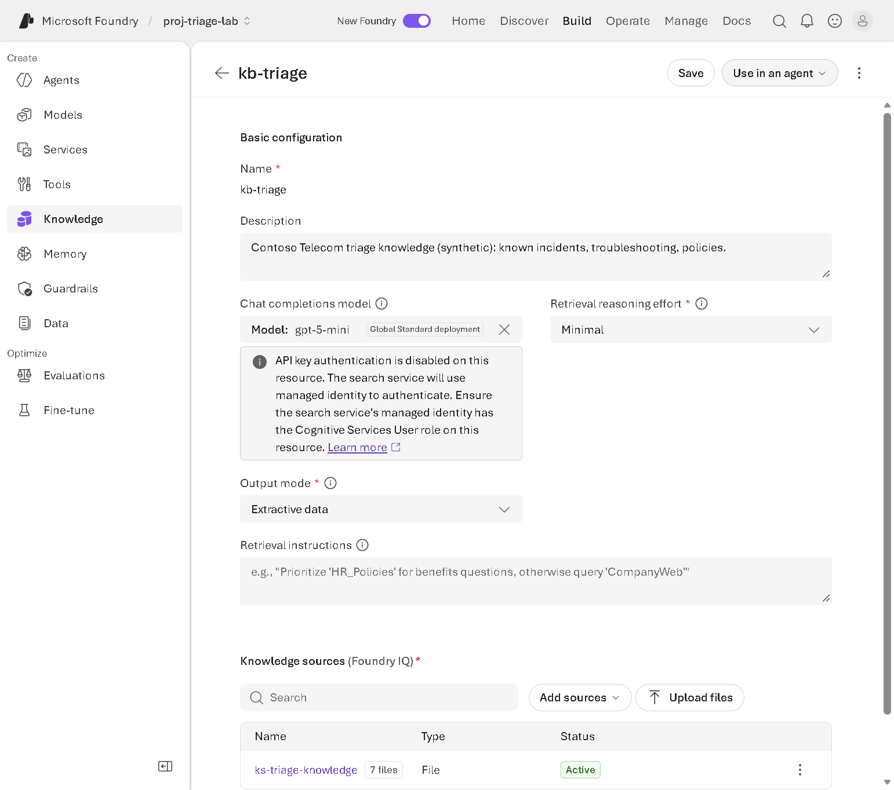
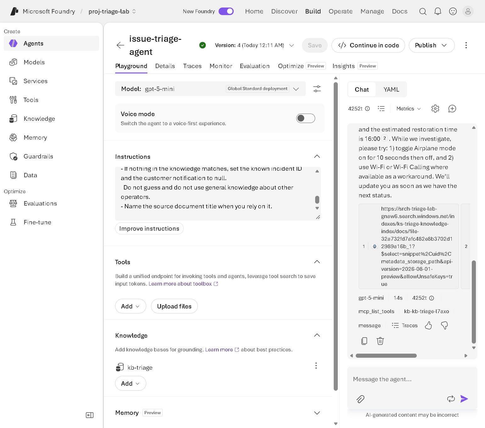

# Module 4 - Configure Foundry IQ with Azure Storage (portal)

## Objective
Ground the Prompt Agent in Contoso Telecom knowledge: put the synthetic documents into a **Foundry IQ knowledge base**, connect it to `issue-triage-agent`, and compare grounded and ungrounded answers. This is the "link an issue to an existing solution" use case.

## Prerequisites
- Module 1 completed.
- Roles listed in [prerequisites.md](../prerequisites.md#roles) for Module 4 (your instructor may assign them before class).

## Terminology
| Term | Meaning |
|---|---|
| **Foundry IQ** | The managed knowledge layer in Microsoft Foundry. It's built on Azure AI Search. The portal page is **Build** > **Knowledge** and is titled **Knowledge (Foundry IQ)**. |
| **Knowledge source** | A connection to content. This module uses **Azure Blob Storage** (option A) or **File** upload (option B, preview). |
| **Knowledge base** | One or more knowledge sources plus retrieval settings. Agents query a knowledge base. |
| **Agentic retrieval** | How the knowledge base plans queries, retrieves content, and returns it with references. |

> **Preview:** Microsoft Learn states that the Foundry portal and Azure portal provide **preview-only** access to agentic retrieval features. The **File** knowledge source is marked **Preview** in the portal. Preview features have no SLA and may change.

## Starting state
Prompt Agent `issue-triage-agent` with the triage instructions and no knowledge.

## Resources used
Azure AI Search (Free tier if available, otherwise Basic), an embedding model deployment, your chat model, and (option A) a storage account.

## The knowledge documents
The [knowledge](../../knowledge) folder contains seven short Markdown documents with synthetic content:

| File | Used for |
|---|---|
| `known-incidents-bulletin.md` | Known incidents KI-2041 (Harbour District data outage), KI-2042 (CBD call drops), KI-2043 (duplicate recharges, resolved), KI-2039 |
| `troubleshooting-mobile-data-and-signal.md` | First steps for signal, data, and home internet issues |
| `esim-sim-and-device-guide.md` | eSIM, voicemail, warranty |
| `billing-disputes-and-refunds.md` | Disputes, suspensions after payment |
| `roaming-support-guide.md` | Roaming steps and priorities |
| `account-and-plan-policy.md` | Plan changes, ownership transfer |
| `complaint-priority-and-routing-policy.md` | Priority definitions and routing |

> **Retrieval tip (teaching point):** knowledge sources split documents into chunks. A chunk that holds an incident's details may not include its heading. That's why each incident in the bulletin repeats its ID in a line such as `- Incident ID: KI-2041`. Without that line, the agent could find the outage but not its ID.

## Steps

### 4.1 Create the Azure AI Search service
1. In the [Azure portal](https://portal.azure.com), create an **Azure AI Search** service in your lab resource group, in the same region as your Foundry project:
   - **Service name**: for example `srchtriagelab<initials>` (lowercase letters and numbers; no hyphens)
   - **Pricing tier**: **Free** if available, otherwise **Basic**. A subscription can have only one Free search service; if one already exists, use Basic (billed while it exists).
2. Under **Settings** > **Identity**, turn **System assigned** managed identity **On**.
3. Under **Settings** > **Keys**, set **API access control** to **Both** (or **Role-based access control**).
4. Copy the **Url** from the **Overview** page (for example `https://srchtriagelabab.search.windows.net`) into your private notes.

> Some regions show "high demand" and don't accept new search services. The [search region list](https://learn.microsoft.com/azure/search/search-region-support) marks them; your instructor picks a region that works.

### 4.2 Check the role assignments
Your instructor assigns these, scoped to the lab resources only (see [instructor-guide.md](../instructor-guide.md#role-checklist)):

| Principal | Role | On |
|---|---|---|
| Foundry **project** managed identity | Search Index Data Reader, Search Index Data Contributor, Search Service Contributor | Search service |
| Your user | Search Service Contributor, Search Index Data Contributor | Search service |
| **Search service** managed identity | Cognitive Services User | Foundry resource (the knowledge base calls your embedding and chat models) |
| **Search service** managed identity (option A only) | Storage Blob Data Reader | Storage account |

> When API-key authentication is disabled on the Foundry resource (common in enterprise tenants), the portal shows: "The search service will use managed identity to authenticate. Ensure the search service's managed identity has the Cognitive Services User role on this resource."

### 4.3 Connect the project to the search service
1. Make sure your project has an embedding deployment. If not, deploy `text-embedding-3-small` from **Discover** > **Models**.
2. In the [Foundry portal](https://ai.azure.com), select **Build** > **Knowledge**.
3. In **Foundry IQ resource**, select your search service. In **Auth Type**, select **Project Managed Identity** (keyless). Select **Connect**.
   > **API Key** is also offered. Prefer **Project Managed Identity**; it needs no stored secret.

### 4.4 Create the knowledge base
1. Select **Create a knowledge base**. On **Create a new knowledge base**, set:
   - **Name**: `kbtriage`
   - **Description**: `Contoso Telecom triage knowledge (synthetic)`
   - **Chat completions model**: your chat deployment (for example `gpt-5-mini`)
   - **Retrieval reasoning effort**: **Minimal** (default)
   - **Output mode**: **Extractive data** (default)
2. Under **Knowledge sources (Foundry IQ)**, add the documents with **one** of the options below.

#### Option A - Azure Blob Storage (official lab path)
1. In the Azure portal, create a storage account in the lab resource group (**Standard**, **LRS**, same region), create a container `triageknowledge`, and upload the seven files. Keep anonymous access disabled.

   > **Naming:** storage account names must be **3-24 lowercase letters and numbers only** — no hyphens (for example `sttriagelab<initials>`). Blob container names allow hyphens, but this lab keeps them hyphen-free for consistency.
2. Back in the knowledge base, select **Add sources** > **Azure Blob Storage**, and set the name `kstriageknowledge`, a description, the storage account, the container `triageknowledge`, the authentication type your instructor specifies (managed identity recommended), **Content extraction mode** `minimal`, and your embedding and chat models.

> **Tenant policy note:** many enterprise tenants enforce **Public network access: Disabled** and **shared key access disabled** on storage accounts. Then neither you nor Azure AI Search can reach the account without private networking, and option A fails. In the validation tenant for this lab, the policy reverted any change, so option B was used.

#### Option B - File upload (preview, no storage account) - validated
1. Select **Upload files** and choose the seven files from the `knowledge` folder.
2. The **Create a knowledge source** dialog shows **File (Preview)**: "Upload files directly — no storage account or connection string needed. Service-managed processing." Set **Name** `kstriageknowledge`, a **Description**, and the **Embedding model**, then select **Create**.

*Figure 4.1 - File (Preview) knowledge source. Observe the note that files go directly to an Azure AI Search index, the embedding model, and the files to upload. Captured from the lab tenant on 5 October 2026.*

3. Select **Save knowledge base**. Wait until the knowledge source shows **7 files** and status **Active**.

*Figure 4.2 - The saved knowledge base. Observe **Use in an agent**, the model and retrieval settings, and the knowledge source status. Captured from the lab tenant.*

### 4.5 Connect the knowledge base to the Prompt Agent
1. Open `issue-triage-agent` (**Build** > **Agents**). In the **Knowledge** section ("Add knowledge bases for grounding"), select **Add** > **Connect to Foundry IQ**.
2. In **Connect to Foundry IQ**, select the **Connection** (your search service) and the **Knowledge base** `kbtriage`, then select **Connect**. The portal adds an MCP tool for the knowledge base and a project connection named `kb-kbtriage-...`.
3. Append the contents of [app/prompts/knowledge_instructions.md](../../app/prompts/knowledge_instructions.md) to the end of the agent's **Instructions**. The first rule, "you must ALWAYS call [the knowledge base tool]", matters: in validation, the agent didn't search the knowledge base until the instructions said so.
4. Select **Save**. Record the new **version** number. You use it in Module 9.

### 4.6 Test grounded and ungrounded behaviour
In the agent **Chat**, select **New chat** and send each message (the issue text is in `app/data/incoming_issues.json`, or run `python -m triage_desk show ISS-1001`):

| Test | Message | Expected |
|---|---|---|
| Answerable from knowledge | ISS-1001 (no data in Harbour District) | Known issue KI-2041 (active Harbour District data outage), the Wi-Fi workaround, next update 12:00 |
| Answerable, Arabic | ISS-1019 | KI-2041, notification in Arabic |
| Answerable, resolved incident | ISS-1003 (duplicate recharge) | KI-2043, automatic refund within 5 business days |
| Not answerable from knowledge | `Is there an outage in Old Town right now? My data has been patchy since lunch.` | No known incident; it doesn't invent one |
| Policy question | ISS-1015 (ownership transfer) | Both people must visit a store with ID |

Compare with the ungrounded answers from Module 1 (use the **Version** selector to switch back to version 2). Without knowledge, the agent can't know about KI-2041.

### 4.7 Review citations and tool calls
- Grounded answers show **numbered citations** (for example `1`, `2`). Each links to a document in the search index created for the knowledge source.
- The response toolbar lists the tool calls, for example `mcp_list_tools` and `kb-kbtriage-...`, which confirms the knowledge base was searched.

*Figure 4.3 - Grounded answer for ISS-1001. Observe **kbtriage** under **Knowledge**, the citation links, and the knowledge base tool in the toolbar. Captured from the lab tenant.*

## Verification checkpoint
- [ ] The knowledge source status is **Active**.
- [ ] ISS-1001 is linked to the Harbour District outage; the Old Town question doesn't invent an incident.
- [ ] Your notes contain the search endpoint, the knowledge base name, and the new agent version.

## Common errors and recovery
| Symptom | Likely cause | Recovery |
|---|---|---|
| The agent never searches the knowledge base | Instructions don't require it | Append `knowledge_instructions.md` (it says "ALWAYS call") and **Save**. |
| Found the outage but not its ID | Chunk without the heading | Keep the `- Incident ID:` lines in the bulletin; re-upload the file in the knowledge source (**Delete file**, then upload and **Save**). |
| Knowledge source stays non-active | Indexing still running or failed | Wait and refresh; check role assignments in step 4.2. |
| Blob source can't reach storage | Tenant policy disables public network access | Use option B, or ask for private networking. |
| No embedding model in the list | No embedding deployment | Deploy `text-embedding-3-small`, then refresh. |
| Free tier not available | One Free service per subscription already exists | Use Basic (cost). |

## Cleanup
Keep the resources for Modules 5 to 9. Final cleanup is in [cost-and-cleanup.md](../cost-and-cleanup.md).

## Knowledge check
1. Which Azure service does Foundry IQ use under the hood?
2. Why does each incident repeat its ID inside its details?
3. Why is Project Managed Identity preferred over an API key?

Answers

1. Azure AI Search.
2. Documents are chunked; a chunk without the heading would lose the ID.
3. No shared secret to store or rotate, and access is controlled with least-privilege role assignments.

## References
- [What is Foundry IQ?](https://learn.microsoft.com/azure/foundry/agents/concepts/what-is-foundry-iq)
- [Connect agents to Foundry IQ knowledge bases](https://learn.microsoft.com/azure/foundry/agents/how-to/foundry-iq-connect)
- [Create a blob knowledge source](https://learn.microsoft.com/azure/search/agentic-knowledge-source-how-to-blob)
- [Azure AI Search role-based access](https://learn.microsoft.com/azure/search/search-security-rbac)
- [Integrate an AI agent with Foundry IQ](https://microsoftlearning.github.io/mslearn-ai-agents/Instructions/Exercises/04-integrate-agent-with-foundry-iq.html) (Microsoft Learning lab)
- [Azure AI Search pricing tiers](https://learn.microsoft.com/azure/search/search-sku-tier)

> **Documentation gap:** Microsoft Learn doesn't document the **File (Preview)** knowledge source or the field-level portal steps. The steps above were validated in the live portal on 5 October 2026. Option A follows the official Microsoft Learning lab and couldn't be validated in the authoring tenant because of storage network policy.
